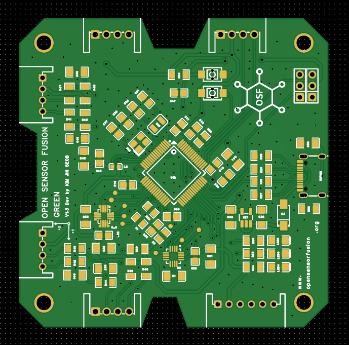
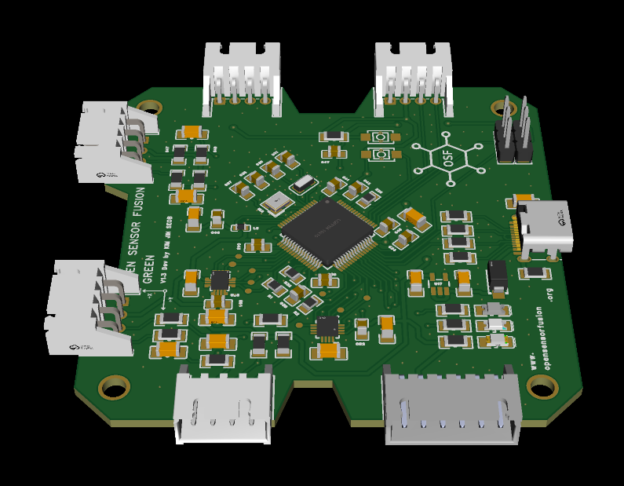
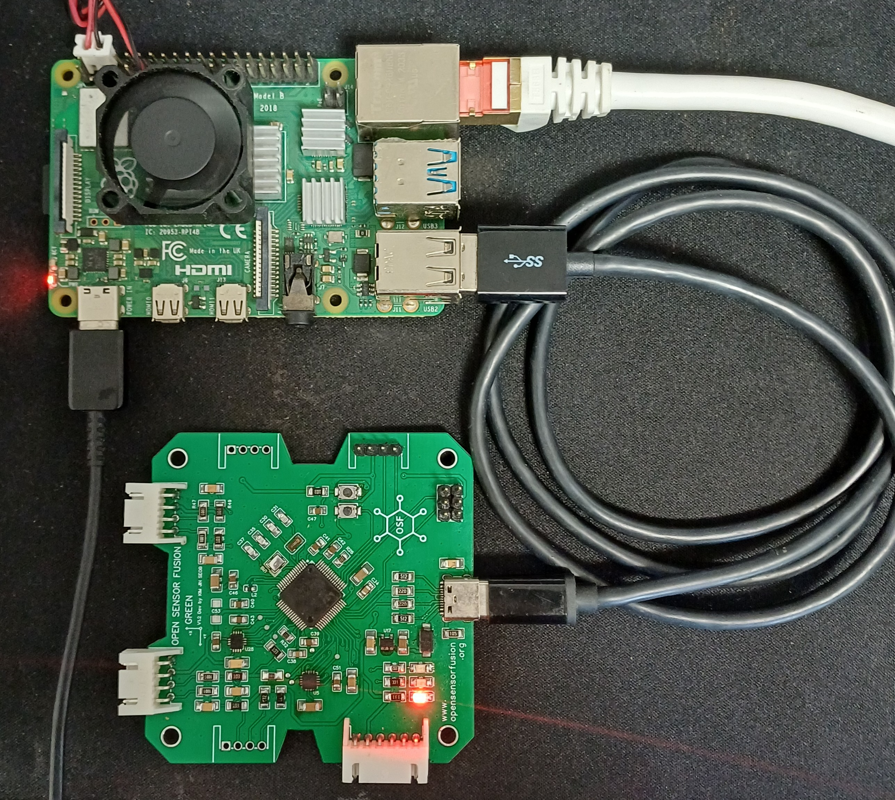

# Open Sensor Fusion Hardware

Open Sensor Fusion is an open hardware project for sensor aggregation
devices and host interface documentation. The first hardware target is
OSF GREEN.

OSF GREEN is a prototype board used to test the OSF0 UART stream with a
Linux IIO host driver. The board presents accel, gyro, magnetometer, and
temperature samples to a host through an OSF0 frame stream.

## OSF GREEN Preview

<table>
  <tr>
    <td width="33%" align="center">
      
    </td>
    <td width="33%" align="center">
      
    </td>
    <td width="33%" align="center">
      
    </td>
  </tr>
  <tr>
    <td align="center">2D PCB top view</td>
    <td align="center">3D board render</td>
    <td align="center">Board with Raspberry Pi</td>
  </tr>
</table>

## Current Hardware Target

- Board: OSF GREEN
- MCU: STM32F405RGT6
- IMU: ICM42688P-class device
- Magnetometer: MMC5983MA
- Host link used for Linux testing: UART OSF0 frame stream
- Tested host path: Raspberry Pi 4 UART serdev to Linux IIO
- Observed IIO devices: `osf-accel`, `osf-gyro`, `osf-magn`, `osf-temp`

## Repository Status

This repository is being organized as the public hardware documentation
location for OSF GREEN. Design files, board photos, schematic exports, PCB
exports, and BOM files should live here.

The Linux RFC driver is limited to the OSF0 UART capability, status, and
sample stream. USB demo output, calibration command surfaces, yaw debug frames,
and fusion/AHRS/Kalman output are not part of the Linux RFC interface.

## Layout

- `hardware/` - board design file organization
- `hardware/schematic/` - schematic source and PDF exports
- `hardware/pcb/` - PCB source, Gerbers, and fabrication notes
- `hardware/bom/` - bill of materials
- `docs/` - board, protocol, Linux host, and release notes
- `firmware-interface/` - host-visible firmware interface notes
- `images/` - board photos and diagrams
- `LICENSES/` - license texts

## License Overview

Hardware design files are intended to use `CERN-OHL-S-2.0`.
Documentation is intended to use `CC-BY-4.0`.

The exact SPDX identifier should be kept with each file or directory when
design files are added. Software scripts, if added, should use a software
license such as `MIT` or `Apache-2.0` and should be documented separately.

This is not legal advice. The current license files are included so the
project can use standard SPDX identifiers and GitHub-visible license text.
