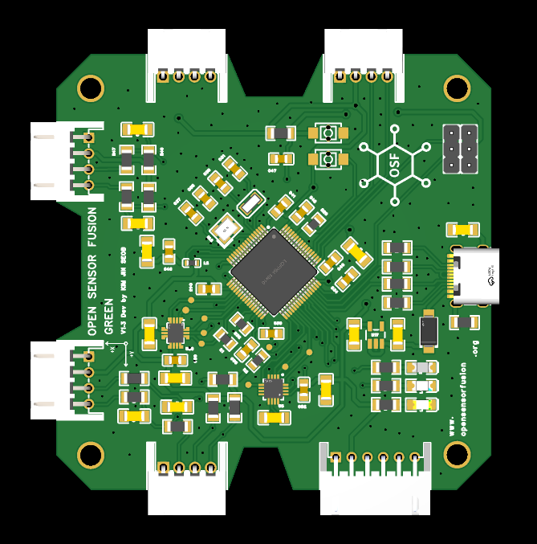

# OSF GREEN

## Overview

OSF GREEN is the first concrete hardware target of Open Sensor Fusion. It is an
STM32F405-based sensor aggregation prototype intended to stream OSF0 frames to a
Linux host.

Board-specific public release artifacts are organized under this directory.
This area is for hardware documentation, artifact locations, and media that help
identify the OSF GREEN board.

## Public artifacts

Use the following locations for public OSF GREEN artifacts:

- BOM: `bom/OSF_GREEN_BOM.csv`
- Optional spreadsheet BOM: `bom/OSF_GREEN_BOM.xlsx`
- Gerber archive: `pcb/OSF_GREEN_Gerber.zip`
- Schematic PDF: `schematic/OSF_GREEN_Schematic.pdf`

## Images

Board-specific images are stored under `images/`:

- Board photos: `images/photos/`
- 2D PCB views: `images/pcb-2d/`
- 3D renders: `images/renders-3d/`

### Board photos

Actual board photos should be placed under `images/photos/`.

Recommended files:

- `images/photos/OSF_GREEN_top.jpg`
- `images/photos/OSF_GREEN_bottom.jpg`
- `images/photos/OSF_GREEN_with_raspberry_pi.jpg`

### 2D PCB views

2D PCB images should be placed under `images/pcb-2d/`.

Recommended files:

- `images/pcb-2d/OSF_GREEN_2d_top.png`
- `images/pcb-2d/OSF_GREEN_2d_bottom.png`

### 3D renders

3D board renders should be placed under `images/renders-3d/`.

Recommended files:

- `images/renders-3d/OSF_GREEN_3d_angle90.png`
- `images/renders-3d/OSF_GREEN_3d_angle30.png`

## README image embedding example

Use an image block like this after the referenced file exists:

```html
<p align="center">
  
</p>
```

## Current status

OSF GREEN is a public hardware target under active documentation. The files in
this directory describe the current public artifact layout and media locations.
No hardware maturity, manufacturing readiness, or host driver acceptance claim is
made here.
